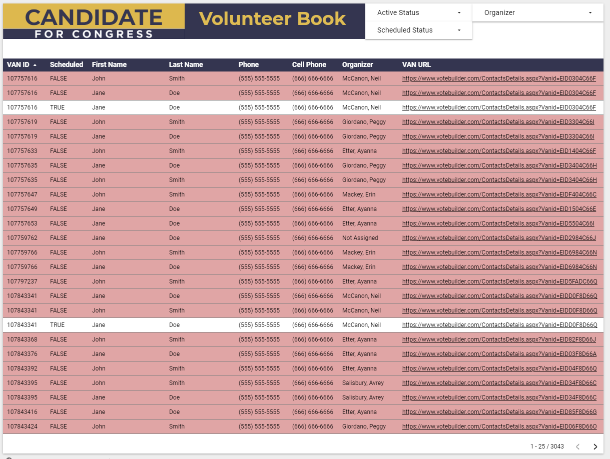
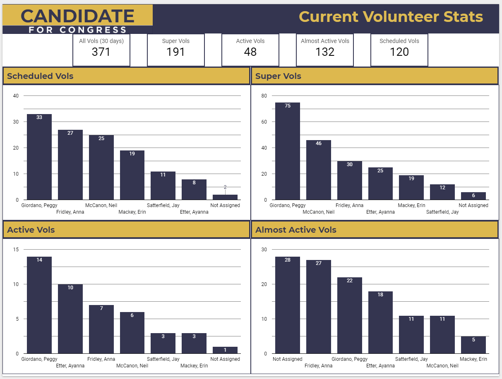

# Volunteer Book

This project utilizes a variety of SQL and Python scripts to transform the Event Participant List data that can be exported from VAN (or queried from Phoenix) into a useful report for the Field team of a political campaign. 

## The Report

The first page of this report provides a list of all volunteers that have ever signed up for an event with a given campaign, and can then be filtered down by volunteer status, scheduled status, and organizer. This is most useful for Field Organizers to quickly determine who are the most important (and most likely to respond) volunteers to contact in any given day. In most cases, the Field Organizer would filter first to only those who are not scheduled, but are assigned to them, and sequentially work through each bucket of volunteer in order of most likely to agree to a shift in the future to least (super vol -> drop off).

The second page of the report is for Field Organizers and Field Directors. It shows overall metrics for number of active volunteers over a 30 day period, as well as how many of each type of volunteer the campaign has in the most recent 30 day period. Just below, Field Directors can see how each of the Field Organizers stack up against each other in terms of type of volunteer, and how many volunteers are scheduled that are associated with each organizer. This also provides a bit of gamification for the Field Organizers, pushing them to make more calls and improve their scripts for shifting, to come out on top against their other organizers.

## The Workflow

The process for building this report was as follows (and can be viewed in the yaml file in the repo):

#### Imports

Using the Civis platform, two imports kicked off the daily scheduled updating of this report. The first import was an update of the event participant list, which had to be manually exported to a google sheet every morning (to reflect shift status updates and newly scheduled shifts). The second import was part of a weekly updated VAN export for all people in the My Campaign side of VAN who belonged to each organizing region.

#### SQL Queries

The workhorse query of this process is the va02_event_participant_moded query which adds the transforms the base event participant list int the following ways:

- Adds the turfed Field Organizer (from the organizing region import) to each VAN ID entry
- Adds the latest Field Organizer who *recruited* that particular VAN ID
- Adds a scheduled boolean value (whether or not that VAN ID is scheduled for a future event)
- Adds total completed shifts over the course of the cycle (not currently utilized in report)
- Adds total declined/no show shifts to determine flake rate (not currently utilized in report)
- Calculates 14 and 30 day rolling counts for how many events a particular VAN ID has completed to calculate status of VAN IDs over time (not currently utilized in report)
- Creates a "proper_organizer" column that assigns a volunteer to an organizer based on last_recruit (if no assigned organizer exists) or prefers the last recruit in certain special cases

Next, the set_current_status query checks all vanids for how many events they've completed in the last 14 and 30 days, and assigns a status based on the count. Currently it is set up as follows:

- Super Active: at least 2 completed shifts in the last 14 days
- Active: less than 2 completed shifts in the last 14 days, at least 2 completed in the last 30 days
- Almost Active: 1 completed  shift in the last 30 days
- Drop Off: Has once signed up, but has not completed a shift in the last 30 days

#### Python Script

With the modified event participant list, the python script vanid_to_url takes each VAN ID and, via some investigation into how urls are built for each VAN ID, re-constructs a url for each VAN ID and adds that to the table.

The fully modified table is exported out of Civis to a Google Sheet, which is then referenced by Google Data Studio for said report.

## Review

The report can be found [here](https://datastudio.google.com/reporting/86e40642-b278-411b-832c-d3ebdce69fef), should you wish to explore it on your own. Keep in mind that, due to scrubbing, some VAN IDs will be repeated in the report.

